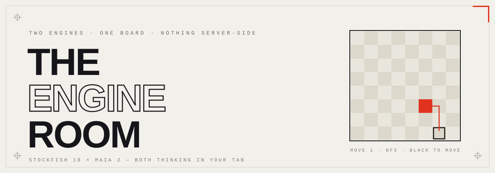
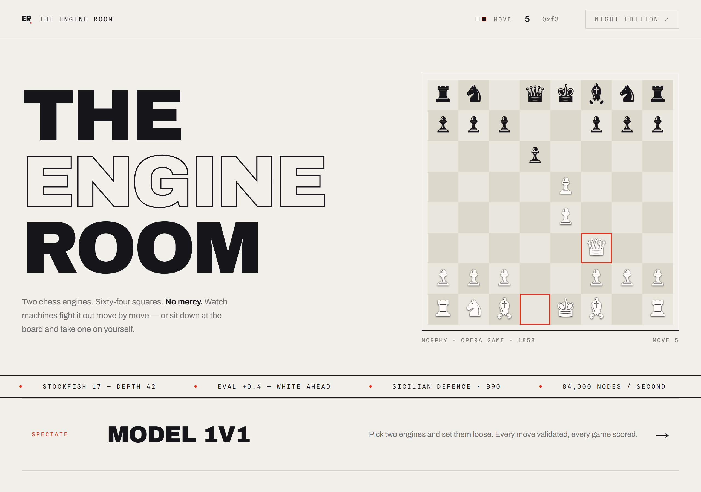
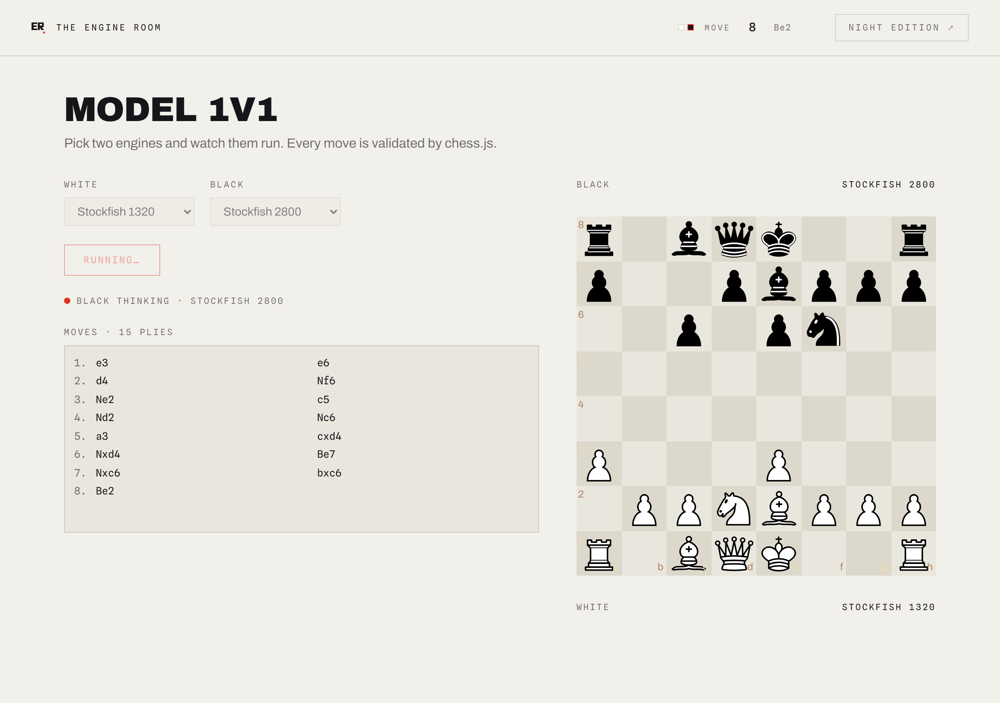
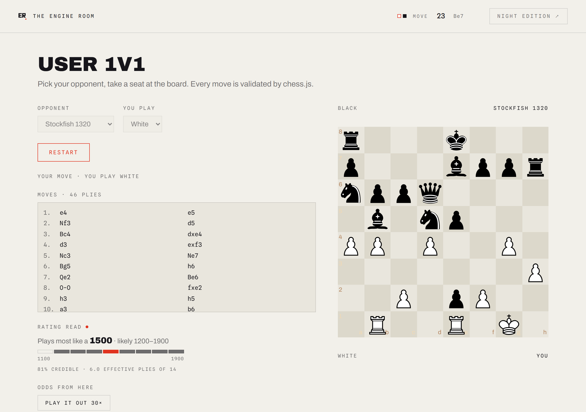
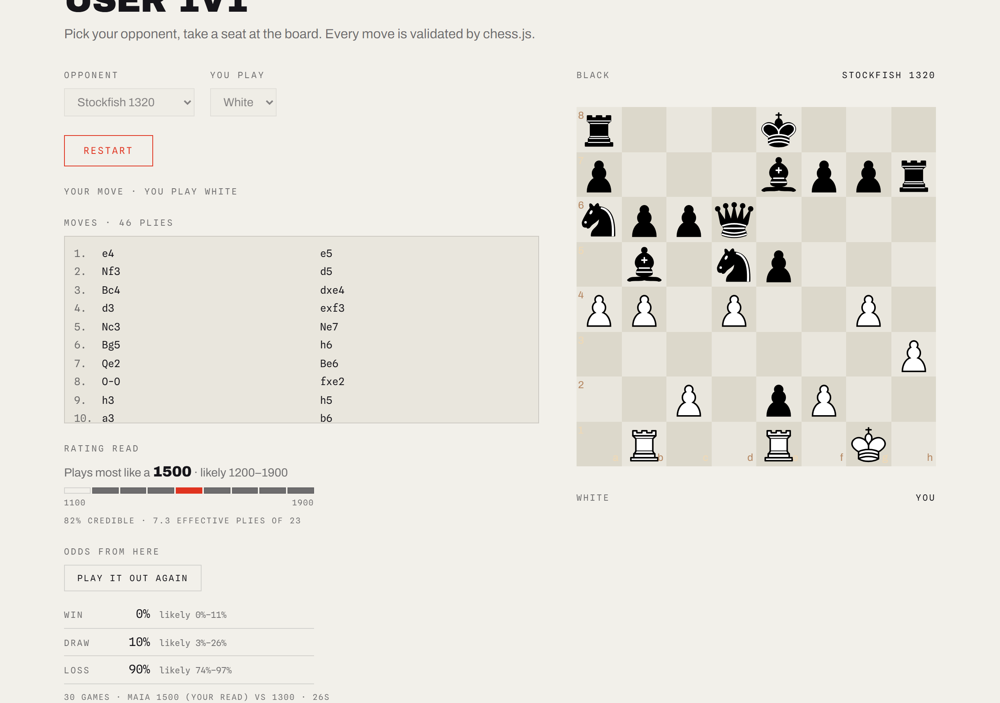
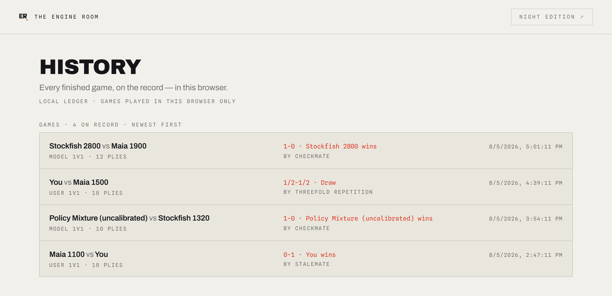
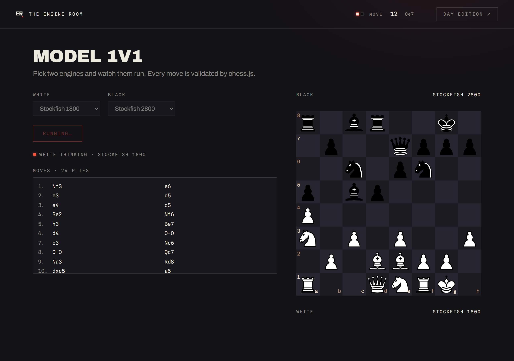
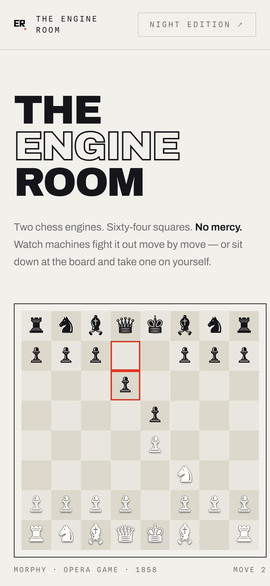
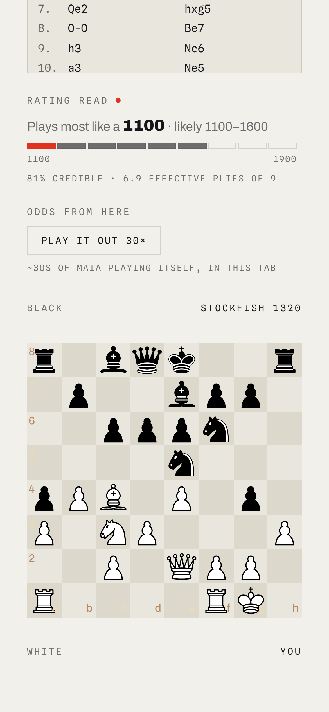
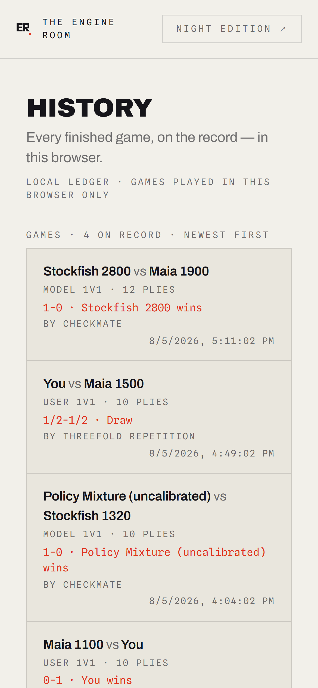

<div align="center">



**The Engine Room puts two real chess engines in your browser and lets you watch them fight — or step onto the board yourself.**


[Live demo](https://the-engine-room-gold.vercel.app) · [How Maia works](docs/maia-notes.md) · [Design notes](docs/design/ink-and-bone-notes.md) · [Build plan](docs/plans/2026-08-03-engine-room-implementation.md) · [Devlog](docs/devlog/)

</div>

---

Most chess apps that let you "play the computer" run one engine on a server and turn a difficulty knob. This one ships **two genuinely different minds** straight to your browser: Stockfish, a classical search engine that plays the best move it can find, and Maia, a neural net trained on millions of human games to play the move a *person* of a given rating would actually play — including the mistakes. Watch them fight each other, play either one yourself, and while you play it quietly reads **your** moves and tells you what rating you play like. There is no backend doing the thinking. Its all your CPU.

> [!NOTE]
> Maia is a 93 MB neural net fetched on first use, so your first Maia game can take a minute or three to wake up (theres a progress bar counting the bytes so you can tell loading from hanging). Thats the model being big, not the site being broken — every game after that in the same tab is instant

## the beautiful gallery

<table>
<tr>
<td width="50%" valign="top">
  
  <p align="center"><sub>the front door. Morphy's Opera Game (1858) replays itself on a loop while you decide</sub></p>
</td>
<td width="50%" valign="top">
  
  <p align="center"><sub>two engines mid-fight. move log, rating labels, and a lamp naming whos thinking</sub></p>
</td>
</tr>
<tr>
<td width="50%" valign="top">
  
  <p align="center"><sub>it reads your own moves and tells you what you play like. as a band, not a number, cause honesty</sub></p>
</td>
<td width="50%" valign="top">
  
  <p align="center"><sub>ask for the odds and it plays your exact position out 30 times, then counts how those games ended</sub></p>
</td>
</tr>
<tr>
<td width="50%" valign="top">
  
  <p align="center"><sub>every finished game, newest first</sub></p>
</td>
<td width="50%" valign="top">
  
  <p align="center"><sub>the night edition. the red stops being printed ink and becomes lit signage</sub></p>
</td>
</tr>
</table>

and it all works on ur phone too:

<table>
<tr>
<td width="33%" valign="top">
  
  <p align="center"><sub>the front door, phone sized</sub></p>
</td>
<td width="33%" valign="top">
  
  <p align="center"><sub>playing an engine, rating readout and all</sub></p>
</td>
<td width="33%" valign="top">
  
  <p align="center"><sub>the ledger fits too</sub></p>
</td>
</tr>
</table>

## See it work!!!!

<!-- drop the demo video in here when its ready:
<a href="https://youtu.be/VIDEO_ID">
  
</a>
-->

Open the [live demo](https://the-engine-room-gold.vercel.app), hit **Model 1v1**, and put Stockfish 2800 against Maia 1100 — an engine that only knows the best move versus a net that only knows what a beginner would do. Or go to **User 1v1** and play Maia at your own level; by around move 8 the readout under the board starts telling you what rating your moves look like, live, and it updates every move you make.

## What Stockfish says vs what actually happens

Stockfish's evaluation answers *"whats the score under best play"*. The odds button answers a different question: *"how does this actually tend to end when players at this rating take it from here"*. Same positions, both engines asked:

| Stockfish says | Maia's 30 playouts say |
|---|---|
| **+6.44** — completely winning | won **73%** of the time. the other 27%, the human-level players let it slip |
| **+0.23** — dead equal | mostly **draws**, as youd hope |
| **−6.28** — completely lost | lost **90%** of the time, so at least the bad news is reliable |

Thats the whole point of having both engines in one app: a position being *winning* and a position being *won by people like you* are genuinely different facts, and now you can see the gap between them. Every number comes with its confidence interval and the sample size on screen, and moving a piece wipes the panel — those numbers described one exact position and it would be lying to leave them up.

---

## How the chess works

```
      /model-1v1                    /user-1v1
          │                             │
          │  runModelGame()             │  onPieceDrop / engineReply
          └──────────────┬──────────────┘
                         │
                getMoveFor(fen, config)      ← the only engine entry point
                         │
            ┌────────────┴────────────┐
            ▼                         ▼
     engineStockfish.ts         engineMaia.ts
     Web Worker · UCI           onnxruntime-web
     postMessage handshake      [1,18,8,8] float32 in, policy
     go movetime 500            logits out, decoded to a move
            │                   and filtered to legal
            └────────────┬────────────┘
                         ▼
                     chess.js          ← sole authority on legality and game end
                         │
                         ▼
                  web/lib/games/store.ts   ← localStorage today, Vercel KV behind a flag
```

### 1. Two real engines, not one engine with a slider

| | Stockfish | Maia |
| --- | --- | --- |
| What it is | Classical alpha-beta search — `stockfish-18-lite-single.wasm` in a Web Worker, driven over UCI | Maia 2 "rapid" — a neural net trained to predict what a *human* of a given rating plays, one forward pass via `onnxruntime-web` |
| Strength control | `UCI_LimitStrength` + `UCI_Elo` — presets 1320 / 1800 / 2800 (1320 is this builds actual floor) | Rating is a **model input**, not a separate network — presets 1100 / 1500 / 1900 feed `elo_self` / `elo_oppo` as bucket indices |
| Time per move | ~500 ms | ~35 ms once loaded |
| Cost | 7 MB, served from `web/public/` | 93 MB, fetched at runtime from a pinned commit in our own mirror repo |

The difference is visible in play, which is the point: Stockfish 1320 plays like a weakened engine, Maia 1100 plays like a 1100-rated person, including the *kinds* of mistakes a person makes.

<details>
<summary>How a chess position becomes a tensor</summary>

Maia 2 takes an 18-plane `8×8` board encoding: 12 planes of piece placement (6 piece types × 2 colors), plus castling rights and en passant — more game state than Maia 3 encodes, which is one of the reasons this app uses 2 (the other is licensing: Maia 2 is MIT, Maia 3's weights are AGPL). The board is always encoded from the movers perspective, so black-to-move positions get mirrored. The policy head outputs logits over 1880 possible moves; we mask to the legal ones chess.js allows and either take the best (gameplay) or sample (rollouts). The full plane layout, the decode, and the measurements are in [`docs/maia-notes.md`](docs/maia-notes.md).

</details>

### 2. One contract, two and a half engines

Everything downstream calls `getMoveFor(fen, config)` and never imports an engine module directly. Adding or dropping an engine is a change to one file — which is what let Maia land *after* the Model 1v1 screen already worked, and later let a third opponent slot in with zero UI changes: the **Policy Mixture** preset, where Stockfish's MultiPV search picks a shortlist of decent moves and Maia picks the one a human would play from it. Its labelled *(uncalibrated)* in the picker because its real strength hasnt been measured yet — see the limits section, we dont label things stronger than we can prove.

### 3. chess.js is the only thing that knows the rules

Engines choose from legal moves; chess.js validates every one and detects every ending (checkmate, stalemate, threefold, fifty-move, insufficient material). If an engine ever returns something illegal its discarded for a random legal move rather than breaking the game. **Zero hand rolled chess rules.** Same philosophy as not rolling your own crypto, honestly.

### 4. Storage is behind an adapter

`web/lib/games/store.ts` writes to localStorage by default and to Vercel KV when `NEXT_PUBLIC_KV_ENABLED=1`. The app is fully demo-able with nothing provisioned, and turning KV on is an env var plus a redeploy, no code change. The history page says which mode its in ("Local ledger" vs "Shared archive") instead of pretending a per-browser list is a global one.

---

## The analysis layer (the part im most proud of)

<table>
<tr>
<td width="33%" valign="top">
  <b>Live rating estimate</b>
  <p><sub>Every move you make gets scored against all nine of Maia's rating buckets, and Bayes' rule turns that into a posterior over "which rating plays like this". It shows nothing until it has enough evidence to be worth reading (about 6 effective plies), and it never names a number without its interval.</sub></p>
</td>
<td width="33%" valign="top">
  <b>Odds from here</b>
  <p><sub>Flat Monte Carlo, not MCTS — 30 independent playouts with Maia moving for both sides, batched through one ONNX session, truncation handled by sampling from the value head so the counts stay honest integers and the Wilson intervals keep meaning what they say.</sub></p>
</td>
<td width="33%" valign="top">
  <b>Fight FX</b>
  <p><sub>19 effects — impact frames, screen shake, ghosts, combo counters, a charge bar fed by Stockfish's real search depth — over a tier ladder that classifies each move. Fully opts out under <code>prefers-reduced-motion</code> or <code>?fx=off</code>.</sub></p>
</td>
</tr>
</table>

The chrome is one system too: an "Ink & Bone" print-shop design (kinetic editorial monochrome, one red accent, no border-radius anywhere), a header scoreboard that reads whichever board is actually running, and a route transition where every navigation is a printing press taking an impression — ink strikes where you clicked. Day is ink on paper; night is the same print shop after hours. [Notes](docs/design/ink-and-bone-notes.md).

---

## the numbers audit (this projects "no bueno")

Two shipped features *read Maia's probabilities as probabilities* — the rating estimate uses them as likelihoods, the rollouts sample from them. So before submitting I audited whether the numbers deserve that trust: when Maia puts 30% on a move, do humans in that bucket actually play it ~30% of the time? Nobody publishes that number (CSSLab publish accuracy, not calibration), so I measured it — 3,015 positions from real rated games, offline, in Node.

The headline finding is a trap worth sharing: **the obvious calibration metric comes out 13× better than the honest one.** Pooled over every (position, legal move) pair, calibration error is 0.0028 — looks perfect. But ~90% of those pairs are moves carrying under 1% probability, where being "calibrated" is trivial. Restrict to the models own top move per position and the error is **0.036, all of it in one direction: overconfidence**, with a fitted temperature of 1.129. When Maia says 84% sure, its right about 73% of the time.

So the verdict on my own features: broadly trustworthy, mildly oversharp at the top, and the wide credible intervals the rating readout draws were the right call. The same measure-before-believing habit caught worse earlier: the rating estimators spec guessed two of its constants an order of magnitude off in units, and shipping them as-written would have made the posterior ignore its own evidence — found by measuring real information content per move, not by reading the spec twice.

<sub>The audit: [`docs/maia-calibration-notes.md`](docs/maia-calibration-notes.md) (PR #28). The constants story: Task 13's "What differed from the spec" in [the plan](docs/plans/2026-08-03-engine-room-implementation.md).</sub>

---

## What these numbers do *not* claim

Analysis features are only worth anything next to their limits, so here is mines plainly 😓

<table>
<tr>
<td valign="top" width="60" align="center">
  
</td>
<td valign="top">
  <b>Maia's first load is slow, and slower on production</b><br>
  <sub>93 MB of weights plus 27 MB of ONNX runtime, and browsers wont disk-cache a body that size, so a page reload pays it again. Measured cold on the live site: 73 s and 261 s. The progress readout counts bytes so you can tell it apart from a hang. An IndexedDB cache is the fix and isnt built yet.</sub>
</td>
</tr>
</table>

<table>
<tr>
<td valign="top" width="60" align="center">
  
</td>
<td valign="top">
  <b>The rating estimate resolves to about ±1 bucket, not 100 points</b><br>
  <sub>Neighbouring Maia buckets differ by 1–3 percentage points on a given move, so a games worth of your play locates you within a couple hundred points and no better — fed Maia's own 1700-rated moves, the posterior peaks at 1600 on one game and 1800 on another. Thats why its drawn as a band. It also measures which buckets move <i>distribution</i> you resemble, which correlates with rating without being the same thing.</sub>
</td>
</tr>
</table>

<table>
<tr>
<td valign="top" width="60" align="center">
  
</td>
<td valign="top">
  <b>The Stockfish ELO presets are unproven as <i>strength</i> settings</b><br>
  <sub>The spike proved Stockfish accepts <code>UCI_Elo</code> and searches; it never proved 1320 actually plays weaker than 2800 over a sample of games (search depth is identical at both — Stockfish weakens by picking worse candidates, not searching less). An SPRT match harness to settle it for real is mid-flight on its own branch right now.</sub>
</td>
</tr>
</table>

<table>
<tr>
<td valign="top" width="60" align="center">
  
</td>
<td valign="top">
  <b>The rollouts model Maia playing Maia, not humans playing humans</b><br>
  <sub>Maia imitates moves from human-vs-human games; chaining its own samples back into itself for dozens of plies is an input distribution nobody has validated against real games. Treat the odds as informative, not precise — the intervals are wide on purpose. Also promotion is always to a queen, sorry underpromotion fans.</sub>
</td>
</tr>
</table>

If you find something I've missed or misstated please reach out! This project is basically a series of "measure it instead of assuming it" moments and id genuinely love more of them.

---

## How its verified

No unit test suite — deliberately, for a build this size — but nothing here was verified by eye either. Verification is **headless-Chrome CDP harnesses** in `web/scripts/` that drive the *production build* and assert on the post-hydration DOM: full games played through the UI with real dispatched pointer drags, illegal moves confirmed rejected, end-of-game records cross-checked against an independent chess.js replay of the move log, animation timelines sampled with `requestAnimationFrame` instead of wall-clock guesses. The big features re-ran the same harnesses **against the live production site** after merging, because a green Vercel build says nothing about client-rendered UI.

The maths got the same treatment: the rollout statistics page checks Wilson intervals against hand-computed cases, the batch evaluator against single evaluations (bit-identical, 0.000e+0), the sampler against its target distribution over 6,000 draws, and a mate-in-1 comes back 30/30 wins. The gallery above is shot by a Playwright spec (`web/e2e/`) — thats a camera, not a test suite, and [`docs/screenshots.md`](docs/screenshots.md) says so.

```bash
cd web && npm run build && npm run start   # the harnesses drive the production build
node scripts/cdp-verify.mjs               # then point one at it
```

## Three days, 28 PRs (and counting!!!)

| Phase | What shipped |
|---|---|
| Planning | The design doc, an 11-task build plan, and parallel-agent lane declarations — all before any code |
| 0 | The two engine spikes: Stockfish over UCI in a worker, Maia 2 via ONNX (the risky one, timeboxed) |
| 1 | Menu, engine registry, game loop, Model 1v1 — the first watchable fight |
| 2–3 | User 1v1 with drag input, history page, storage adapter |
| Redesign | Ink & Bone: the whole visual system, header scoreboard, brand mark, the printing-press route transition, Fight FX |
| Day three | The analysis layer: live rating inference, Monte Carlo odds, the policy-mixture opponent, the calibration audit |

<sub>Planned on the 3rd, built on the 4th and 5th. Every change landed as a squash-merged PR off `main`, every commit signed and verified.</sub>

## How I worked

Several Claude Code agents in parallel, and this repo keeps the paper trail instead of hiding it. [`AGENTS.md`](AGENTS.md) is the rulebook — signed commits, no AI co-author trailers, human-sounding messages — and the interesting part is that its **hook-enforced**, not honor-system: `.githooks/` rejects unsigned pushes and AI-attribution trailers mechanically. Agents claimed lanes in writing ([`docs/devlog/`](docs/devlog/)) so nobody landed on the same files, specs were written *before* the work, and every task in [the plan](docs/plans/2026-08-03-engine-room-implementation.md) carries a "What differed from the plan" section recording where reality disagreed with the spec — which it did, measurably, almost every time. The architecture calls, the priority order, and every scope decision were mine; the repo is set up so the reasoning is checkable rather than trusted, same philosophy as my last project.

## Run it yourself (if the vercel doesnt work for some reason)

Everything runs from `web/`, not the repo root:

```bash
cd web
npm install
npm run dev          # http://localhost:3000
```

For anything you plan to trust, use the production build — its what Vercel runs and it catches what the dev server wont:

```bash
npm run build
npm run start
```

Two things that will otherwise eat your afternoon (both documented at length in [`docs/deployment.md`](docs/deployment.md) §4): use **`localhost`, not `127.0.0.1`**, against `next dev` — Next 16 treats `127.0.0.1` as cross-origin and serves you a page that renders perfectly and never hydrates. And **rebuild after adding anything to `web/public/`** — Next snapshots that folder at build time.

<details>
<summary>Deploying your own</summary>

One Vercel project: import the repo, set **Root Directory to `web`** (the app doesnt live at the repo root — Next and npm resolve their configs from wherever the build runs, so the whole project moved down a level), leave everything else default. `main` is production; every PR gets a preview URL.

Game history runs on localStorage out of the box. To make it a shared archive, connect an Upstash Redis store, set `NEXT_PUBLIC_KV_ENABLED=1`, and redeploy — the full runbook is [`docs/deployment.md`](docs/deployment.md) §3.

</details>

<details>
<summary>Repo map</summary>

```
docs/                     see docs/README.md — reference vs process, split on purpose
web/                      the Next.js app — everything below is relative to here
  app/                      routes (App Router)
    actions/games.ts          the two KV Server Actions — the only server-side code
    dev/                      verification harnesses, not part of the app
  components/               Board, EngineConfigPicker, ResultScreen, header, brand mark…
    fx/                       the fight-FX stage and its stylesheet
  lib/
    analysis/                 rating inference: maiaLikelihood · ratingPosterior
    chess/                    engineStockfish · engineMaia · engines (getMoveFor) · gameLoop · maiaRollout
    fx/                       effect definitions, move classification, runtime
    games/                    storage: types · localStore · store (the adapter facade)
  public/
    stockfish/                7 MB single-threaded wasm build
    ort/                      26.9 MB onnxruntime-web jsep pair — exactly the two files ORT fetches
  scripts/                  CDP verification harnesses, icon generation
  e2e/                      the Playwright gallery camera
```

</details>

## Where the reasoning lives

This repo keeps its reasoning, not just its code — [docs/](docs/) has the full index, split into *reference* (kept current) and *process* (deliberately not rewritten after the fact, so it records what was believed at the time — several docs are wrong in interesting ways and say so).

| Path | Whats in it |
|---|---|
| [`docs/maia-notes.md`](docs/maia-notes.md) | The Maia integration end to end: why Maia 2 over 1 and 3, the tensor layout, the policy decode, the measurements |
| [`docs/maia-calibration-notes.md`](docs/maia-calibration-notes.md) | The audit: are Maia's probabilities actually probabilities (mostly, mildly overconfident) |
| [`docs/deployment.md`](docs/deployment.md) | Branch workflow, Vercel, the KV runbook, and a long §4 of production traps that each cost someone an afternoon |
| [`docs/specs/`](docs/specs/) | Design specs per feature, written before the work |
| [`docs/plans/`](docs/plans/) | The build plan, with per-task "What differed from the plan" post-mortems |
| [`docs/reviews/`](docs/reviews/) | Independent review briefs — the Maia one reproduces the browser encoder against CSSLab's own training pipeline in Python |
| [`docs/devlog/`](docs/devlog/) | Lane declarations and the agent kickoff prompt — how the parallel work didnt collide |

## Stack

| | |
|---|---|
| App | Next.js 16 (App Router) + TypeScript + Tailwind 4, deployed on Vercel |
| Engines | `stockfish` 18 lite-single wasm in a Web Worker · Maia 2 rapid via `onnxruntime-web` |
| Rules | chess.js — the sole authority, **zero hand rolled chess logic** |
| Board | react-chessboard v5 |
| Storage | localStorage today, Vercel KV behind one env flag, no accounts ever |

<sub>love from miamiiiiii 💙</sub>

<sub>MIT licensed.</sub>
